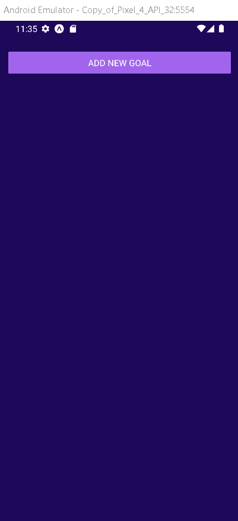

<a name="readme-top"></a>

[![Contributors][contributors-shield]][contributors-url]
[![Forks][forks-shield]][forks-url]
[![Stargazers][stars-shield]][stars-url]
[![Issues][issues-shield]][issues-url]
[![MIT License][license-shield]][license-url]
[![LinkedIn][linkedin-shield]][linkedin-url]

<!-- TABLE OF CONTENTS -->
<details>
  <summary>Table of Contents</summary>
  <ol>
    <li>
      <a href="#about-the-project">About The Project</a>
      <ul>
        <li><a href="#built-with">Built With</a></li>
      </ul>
    </li>
    <li>
      <a href="#getting-started">Getting Started</a>
      <ul>
        <li><a href="#prerequisites">Prerequisites</a></li>
        <li><a href="#installation">Installation</a></li>
      </ul>
    </li>
    <!-- <li><a href="#roadmap">Roadmap</a></li> -->
    <li><a href="#contributing">Contributing</a></li>
    <li><a href="#license">License</a></li>
    <li><a href="#contact">Contact</a></li>
    <li><a href="#acknowledgments">Acknowledgments</a></li>
  </ol>
</details>

<h1 align="center">
    TODO
</h1>

<!-- ABOUT THE PROJECT -->
## About The Project

<div align="center">

<p style="display: flex; align-items: flex-start; justify-content: center;">
   

</p>
</div>

Welcome to the _GitHub repository_ of my **TODO** project! Here you can find information about the project's development, such as which technologies were used, how to install and run the project, usage and more.

This site provides a form to search TODOs.

<p align="right">(<a href="#readme-top">back to top</a>)</p>

### Built With

* [![React-Native][React-Native]][React-Native-url]
* [![React][React.js]][React-url]

<p align="right">(<a href="#readme-top">back to top</a>)</p>

<!-- GETTING STARTED -->
## Getting Started

To get a local copy up and running follow these simple example steps.

### Prerequisites

* npm
  ```sh
  npm install npm@latest -g
  ```

### Installation
1. You need to install React Native by this guide: https://facebook.github.io/react-native/docs/getting-started.html

2. Clone the repo
   ```sh
   git clone https://github.com/paulofelipebrito/todo-React-Native
   ```
3. Install NPM packages
   ```sh
   yarn install 
   ```
4. Start the app with yarn
   ```sh
   react-native run-ios  // run the iOs simulater
   react-native run-android // run on Android simulator
   ```
   
<p align="right">(<a href="#readme-top">back to top</a>)</p>

<!-- ROADMAP
## Roadmap

- [x] Add Changelog
- [x] Add back to top links
- [ ] Add Additional Templates w/ Examples
- [ ] Add "components" document to easily copy & paste sections of the readme
- [ ] Multi-language Support
    - [ ] Chinese
    - [ ] Spanish

<p align="right">(<a href="#readme-top">back to top</a>)</p> -->


<!-- CONTRIBUTING -->
## Contributing

Contributions are what make the open source community such an amazing place to learn, inspire, and create. Any contributions you make are **greatly appreciated**.

If you have a suggestion that would make this better, please fork the repo and create a pull request. You can also simply open an issue with the tag "enhancement".
Don't forget to give the project a star! Thanks again!

1. Fork the Project
2. Create your Feature Branch (`git checkout -b feature/AmazingFeature`)
3. Commit your Changes (`git commit -m 'Add some AmazingFeature'`)
4. Push to the Branch (`git push origin feature/AmazingFeature`)
5. Open a Pull Request

<p align="right">(<a href="#readme-top">back to top</a>)</p> 


<!-- LICENSE -->
## License

Distributed under the MIT License. See `LICENSE.txt` for more information.

<p align="right">(<a href="#readme-top">back to top</a>)</p>


<!-- CONTACT -->
## Contact

Paulo Felipe Brito - [LinkedIn](https://www.linkedin.com/in/paulofelipebrito/) - paulofelipebrito@hotmail.com

Project Link: [https://github.com/paulofelipebrito/todo-React-Native](https://github.com/paulofelipebrito/todo-React-Native)

<p align="right">(<a href="#readme-top">back to top</a>)</p>

## Acknowledgments

This project was developed with the following technologies:

- ✔️ React Native
  
- ✔️ React Hooks

<!-- ACKNOWLEDGMENTS
## Acknowledgments

Use this space to list resources you find helpful and would like to give credit to. I've included a few of my favorites to kick things off!

* [Choose an Open Source License](https://choosealicense.com)
* [GitHub Emoji Cheat Sheet](https://www.webpagefx.com/tools/emoji-cheat-sheet)
* [Malven's Flexbox Cheatsheet](https://flexbox.malven.co/)
* [Malven's Grid Cheatsheet](https://grid.malven.co/)
* [Img Shields](https://shields.io)
* [GitHub Pages](https://pages.github.com)
* [Font Awesome](https://fontawesome.com)
* [React Icons](https://react-icons.github.io/react-icons/search) -->

<!-- <p align="right">(<a href="#readme-top">back to top</a>)</p> -->

<!-- MARKDOWN LINKS & IMAGES -->
<!-- https://www.markdownguide.org/basic-syntax/#reference-style-links -->
[contributors-shield]: https://img.shields.io/github/contributors/paulofelipebrito/githubprofiles.svg?style=for-the-badge
[contributors-url]: https://github.com/paulofelipebrito/todo-React-Native/graphs/contributors
[forks-shield]: https://img.shields.io/github/forks/paulofelipebrito/githubprofiles.svg?style=for-the-badge
[forks-url]: https://github.com/paulofelipebrito/todo-React-Native/network/members
[stars-shield]: https://img.shields.io/github/stars/paulofelipebrito/githubprofiles.svg?style=for-the-badge
[stars-url]: https://github.com/paulofelipebrito/todo-React-Native/stargazers
[issues-shield]: https://img.shields.io/github/issues/paulofelipebrito/githubprofiles.svg?style=for-the-badge
[issues-url]: https://github.com/paulofelipebrito/todo-React-Native/issues
[license-shield]: https://img.shields.io/github/license/paulofelipebrito/githubprofiles.svg?style=for-the-badge
[license-url]: https://github.com/paulofelipebrito/todo-React-Native/LICENSE.txt
[linkedin-shield]: https://img.shields.io/badge/-LinkedIn-black.svg?style=for-the-badge&logo=linkedin&colorB=555
[linkedin-url]: https://www.linkedin.com/in/paulofelipebrito/
[product-screenshot]: images/screenshot.png
[Next.js]: https://img.shields.io/badge/next.js-000000?style=for-the-badge&logo=nextdotjs&logoColor=white
[Next-url]: https://nextjs.org/
[React.js]: https://img.shields.io/badge/React-20232A?style=for-the-badge&logo=react&logoColor=61DAFB
[React-Native]: https://img.shields.io/badge/React_Native-20232A?style=for-the-badge&logo=react&logoColor=61DAFB
[Typescript]: https://img.shields.io/badge/TypeScript-007ACC?style=for-the-badge&logo=typescript&logoColor=white
[React-url]: https://reactjs.org/
[React-Native-url]: https://reactnative.dev
[Vue.js]: https://img.shields.io/badge/Vue.js-35495E?style=for-the-badge&logo=vuedotjs&logoColor=4FC08D
[Vue-url]: https://vuejs.org/
[Angular.io]: https://img.shields.io/badge/Angular-DD0031?style=for-the-badge&logo=angular&logoColor=white
[Angular-url]: https://angular.io/
[Svelte.dev]: https://img.shields.io/badge/Svelte-4A4A55?style=for-the-badge&logo=svelte&logoColor=FF3E00
[Svelte-url]: https://svelte.dev/
[Laravel.com]: https://img.shields.io/badge/Laravel-FF2D20?style=for-the-badge&logo=laravel&logoColor=white
[Laravel-url]: https://laravel.com
[Bootstrap.com]: https://img.shields.io/badge/Bootstrap-563D7C?style=for-the-badge&logo=bootstrap&logoColor=white
[Bootstrap-url]: https://getbootstrap.com
[JQuery.com]: https://img.shields.io/badge/jQuery-0769AD?style=for-the-badge&logo=jquery&logoColor=white
[JQuery-url]: https://jquery.com 
[Typescript-url]: (https://www.typescriptlang.org)
